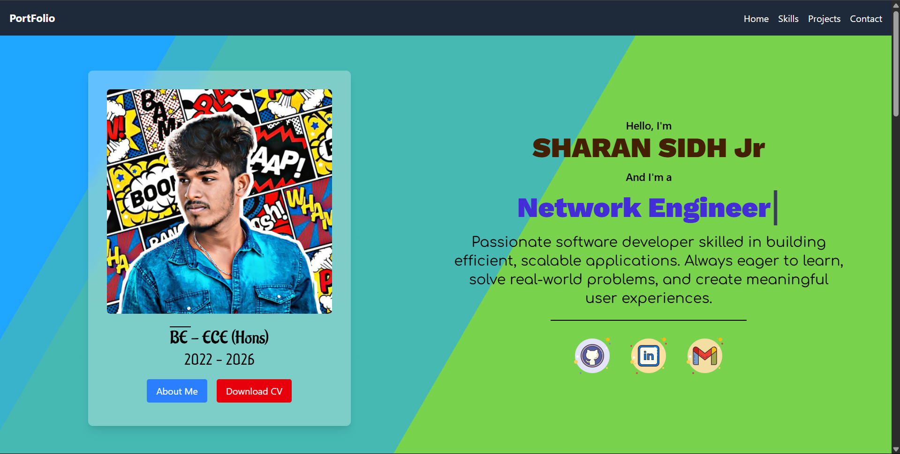

## ✨ Features

- **Dynamic Hero & About Sections:** Get to know me at a glance.
- **Tech Stack Carousel:** Explore the technologies I wield.
- **Animated Achievements Slideshow:** See my proudest moments, complete with certificates and awards.
- **Project Gallery:** Dive into my favorite creations, each with live demos and code links.
- **Responsive Design:** Looks stunning on any device.
- **Modern UI:** Crafted with React, Tailwind CSS, and slick-carousel for smooth, interactive experiences.

---


## 🛠️ Built With

- [React](https://react.dev/)
- [Tailwind CSS](https://tailwindcss.com/)
- [Slick Carousel](https://react-slick.neostack.com/)
- [React Icons](https://react-icons.github.io/react-icons/)
- Passion, curiosity, and a dash of caffeine ☕

---

## 📸 Home Page Preview


---

## 🚦 Getting Started

1. **Clone the repo**
   ```sh
   git clone https://github.com/yourusername/your-portfolio.git
   cd your-portfolio
   ```

2. **Install dependencies**
   ```sh
   npm install
   ```

3. **Start the development server**
   ```sh
   npm start
   ```

4. **Open in your browser**
   ```
   http://localhost:3000
   ```

---

## 🖼️ Add Your Own Achievements

- Place your certificates/photos in `public/pictures/Achievements/`.
- Update the `Achievements.jsx` data array with your new images and descriptions.

---

## 🌐 Live Demo

[View Portfolio Live](https://sidh-profolio.vercel.app/)

---

## 🤝 Connect With Me

- [LinkedIn](https://www.linkedin.com/in/sharansidh0301/)
- [Twitter](https://twitter.com/yourhandle)
- [Email](mailto:your.sharansidh0301@gmail.com)

---

## License

This project is licensed under the Creative Commons Legal Code CC0-1.0 License.

You may use, modify, and share this project for personal or educational use, as long as proper credit is given and no commercial use is made.

© 2025 sharansidh-0301

🔗 License: [CC0-1.0 License](https://creativecommons.org/licenses/by-nc/4.0/)

---

## Credits

- Background animation by [Chris Smith](https://codepen.io/chris22smith/pen/RZogMa)  
  Used under fair-use for non-commercial personal portfolio. All rights remain with the author.

---

> “The best way to predict the future is to invent it.” – Alan Kay 

---
